# Dice & Digits

A mobile-first score keeper for board game night, in **Polish and English**.
Installable as a PWA, works offline, hosted on GitHub Pages, with an optional
Cloudflare Worker for shared groups and live scoreboards.

## Funkcje (po polsku)

Mobilny licznik punktów na wieczór z planszówkami, po **polsku i angielsku**.
Instalowalna aplikacja PWA, działa offline, hostowana na GitHub Pages, z
opcjonalnym Cloudflare Workerem do wspólnych grup i tablic wyników na żywo.

<table>
<tr>
<td align="center" width="20%">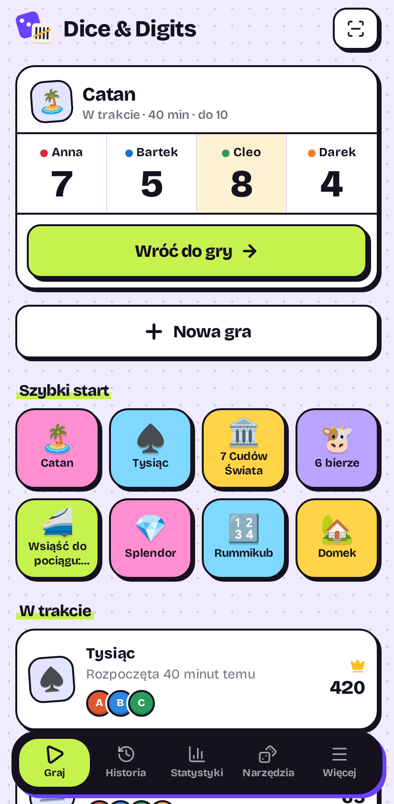<br><sub>Ekran główny</sub></td>
<td align="center" width="20%"><br><sub>Tryb licznika</sub></td>
<td align="center" width="20%">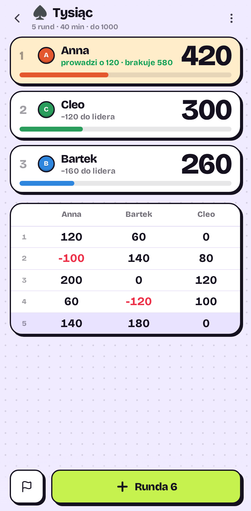<br><sub>Tryb rund</sub></td>
<td align="center" width="20%">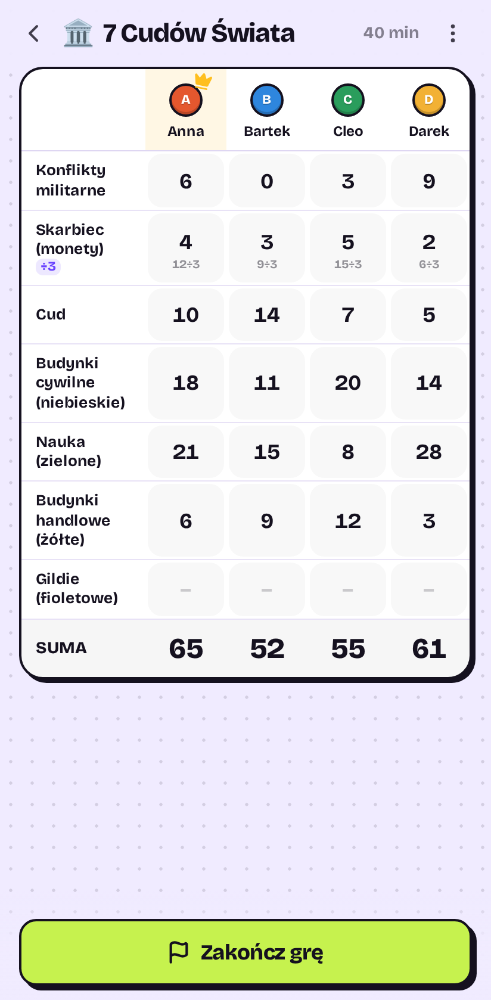<br><sub>Karta wyników</sub></td>
<td align="center" width="20%">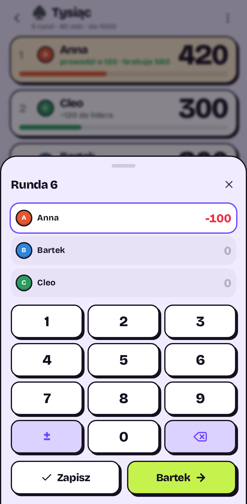<br><sub>Klawiatura liczbowa</sub></td>
</tr>
</table>

<table>
<tr>
<td align="center" width="20%">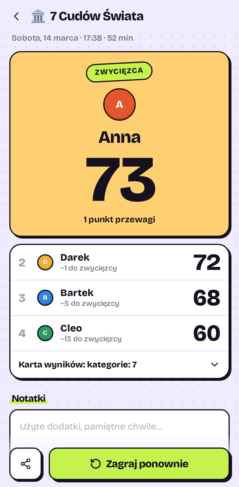<br><sub>Wyniki</sub></td>
<td align="center" width="20%">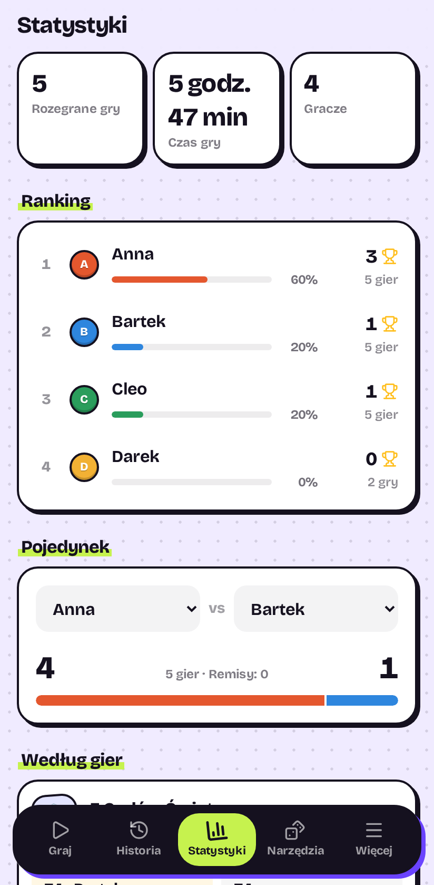<br><sub>Statystyki</sub></td>
<td align="center" width="20%">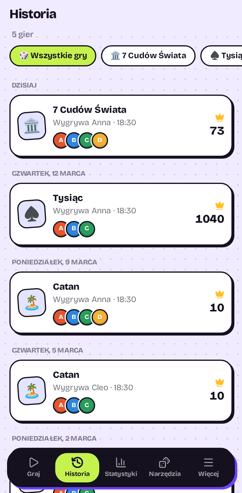<br><sub>Historia</sub></td>
<td align="center" width="20%">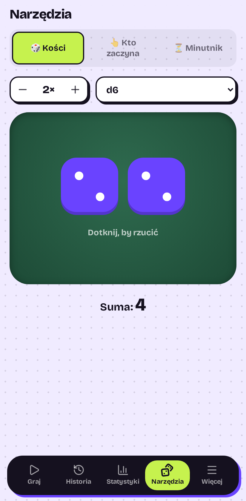<br><sub>Rzut kośćmi</sub></td>
<td align="center" width="20%">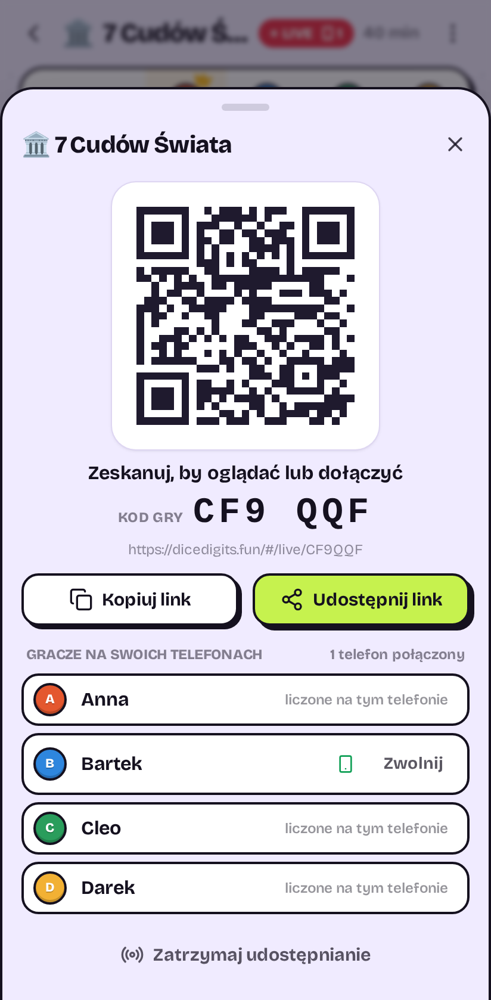<br><sub>Kod QR gry na żywo</sub></td>
</tr>
</table>

**Liczenie punktów: cztery tryby pokrywają prawie każdą grę**

| Tryb                 | Jak działa                                                                  | Dobre do                                     |
| -------------------- | --------------------------------------------------------------------------- | -------------------------------------------- |
| **Licznik**          | Duże przyciski `+`/`−` przy każdym graczu, szybkie kroki, każde stuknięcie w historii | Catan, Splendor, Cortex, Mordercze krewetki  |
| **Rundy**            | Po każdej rundzie wpisujesz punkty wszystkich; każdą rundę można poprawić   | Tysiąc, 6 bierze, Lato z komarami, Rummikub  |
| **Karta wyników**    | Tabela kategoria × gracz wypełniana na koniec, z automatycznymi premiami    | 7 Cudów Świata, Domek, Szybka kawka, Zuuupa! |
| **Tylko zwycięzca**  | Bez punktów: stukasz, kto wygrał rundę (albo kto przegrał)                  | Eksplodujące kotki, Gorący ziemniak          |

- **28 wbudowanych gier** z prawdziwą punktacją: 7 Cudów Świata, Na
  skrzydłach, Terraformacja Marsa, Wsiąść do pociągu (+ Europa ze stacjami),
  Tysiąc, 6 bierze, Rummikub, Domek, Szybka kawka, Zuuupa!, Yahtzee z premią
  +35 za górną sekcję i inne. Do tego **własne gry** z dowolnymi kategoriami,
  szybkimi przyciskami, progiem punktów i zasadą „wygrywa najmniej".
- **Liczysz sztuki, nie punkty**: kategoria może być warta ×n za sztukę (3
  kafelki ulepszeń ×2, niewykorzystane stacje ×4, warzywa w Zuuupa! ×3…×7) albo
  ÷n (7 Cudów: 1 punkt za 3 monety). Wpisujesz to, co leży na stole, a
  aplikacja liczy za Ciebie.
- **Rundy z sumą zerową** (Rummikub): przegrani wpisują swoje punkty ujemne,
  jedno stuknięcie daje zwycięzcy rundy ich sumę.
- **Własna klawiatura liczbowa**, bo numeryczna klawiatura iOS nie ma minusa,
  a ujemne wyniki to codzienność (Tysiąc, nieudane trasy).
- Korona lidera, komunikat o osiągnięciu progu, cofanie, historia każdego
  stuknięcia i wybór **dogrywki** na ekranie wyników (albo zostawienie
  wspólnego zwycięstwa).
- **Ekran nie gaśnie** podczas gry (Wake Lock), wibracje przy stuknięciach na
  Androidzie.

**Po grze**

- Podium i wyniki, podział na rundy/kategorie, notatki, „zagraj ponownie" w tym
  samym składzie, udostępnienie wyniku jako tekstu.
- **Historia** pogrupowana po dniach, z filtrem po grze.
- **Statystyki**: liczba rozegranych gier, czas gry, ranking wygranych,
  rekordy w poszczególnych grach i średni wynik zwycięzcy, **pojedynki**
  dowolnych dwóch graczy.

**Narzędzia przy stole**: kości (d4–d20, moneta), **wybór pierwszego gracza
palcami** (wszyscy dotykają ekranu, losowany jest jeden palec) i **minutnik
tury** restartowany stuknięciem.

**Opcjonalna chmura** (wymaga workera):

- **Wspólna grupa**: znajomi dołączają przez link z zaproszeniem; gracze,
  własne gry i zakończone partie synchronizują się na wszystkich telefonach, więc
  statystyki są wspólne.
- **Gra na żywo z kodem QR**: osoba prowadząca punktację stuka *Udostępnij na
  żywo*, pojawia się kod QR (oraz 6-znakowy kod do przepisania), a znajomi go
  skanują:
  - **oglądają**: wyniki aktualizują się natychmiast na ich telefonach, albo
  - **dołączają do liczenia**: wybierają swoje miejsce i wpisują własne
    punkty, np. swoją kolumnę w 7 Cudach na koniec, swoje +/− w Catanie albo
    wynik w każdej rundzie Tysiąca. Mogą edytować tylko swoje miejsce.
- Zaproszenie do grupy to także kod QR (*Więcej → Wspólna grupa → Zaproś*).
- **Kopia zapasowa w chmurze**: jedno stuknięcie zapisuje graczy, własne gry i
  zakończone partie, bez zakładania konta. Dostajesz sześć łatwych słów do
  zapamiętania (i kod QR), po polsku lub angielsku; wpisanie ich na nowym
  telefonie albo po wyczyszczeniu przeglądarki przywraca wszystko i scala z tym,
  co już jest.

### Jak działa gra na żywo

Jeden telefon jest **prowadzącym** (hostem). Może edytować wszystkie miejsca,
działa też offline i pozostaje źródłem prawdy. Gracze, którzy dołączyli,
wysyłają przez workera drobne zmiany wyniku („ops"). Host stosuje je według
tych samych zasad co własne stuknięcia i rozsyła wynik wszystkim. Jeśli telefon
hosta zniknie (zablokowany ekran, brak zasięgu), gracze liczą dalej: ich wpisy
czekają w pokoju i trafiają do gry, gdy tylko host wróci. Każda zmiana ma
identyfikator, więc ponowne wysłanie po utracie połączenia nigdy nie zostanie
policzone dwa razy. Host nadal może cofać, poprawiać wszystko i zwalniać
miejsca, na przykład gdy komuś padnie bateria.

**Reszta**: PL/EN (wykrywany automatycznie, można przełączyć), motyw
automatyczny/jasny/ciemny bez migotania, eksport i import kopii JSON, praca
offline po pierwszym załadowaniu oraz komunikat „aktualizacja gotowa", dzięki
któremu nowa wersja nigdy nie przeładuje aplikacji w środku gry.

## Screenshots

<table>
<tr>
<td align="center" width="20%">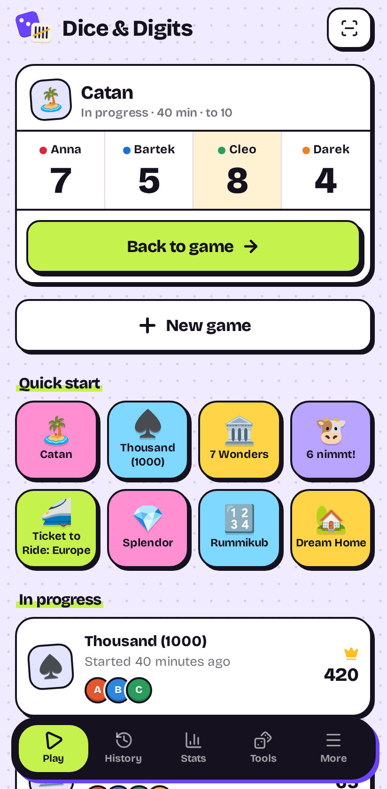<br><sub>Home</sub></td>
<td align="center" width="20%">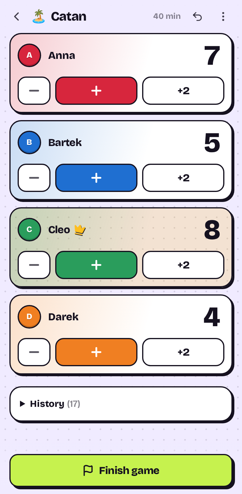<br><sub>Counter mode</sub></td>
<td align="center" width="20%">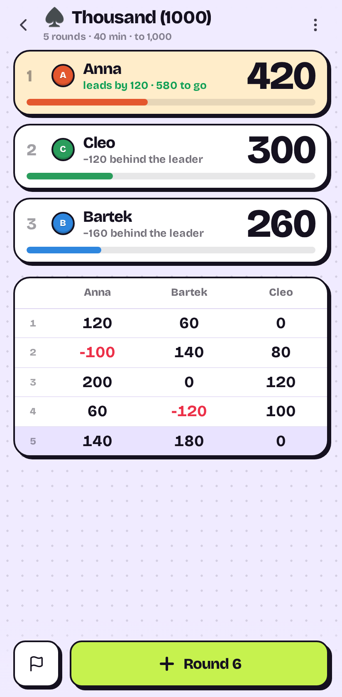<br><sub>Rounds mode</sub></td>
<td align="center" width="20%">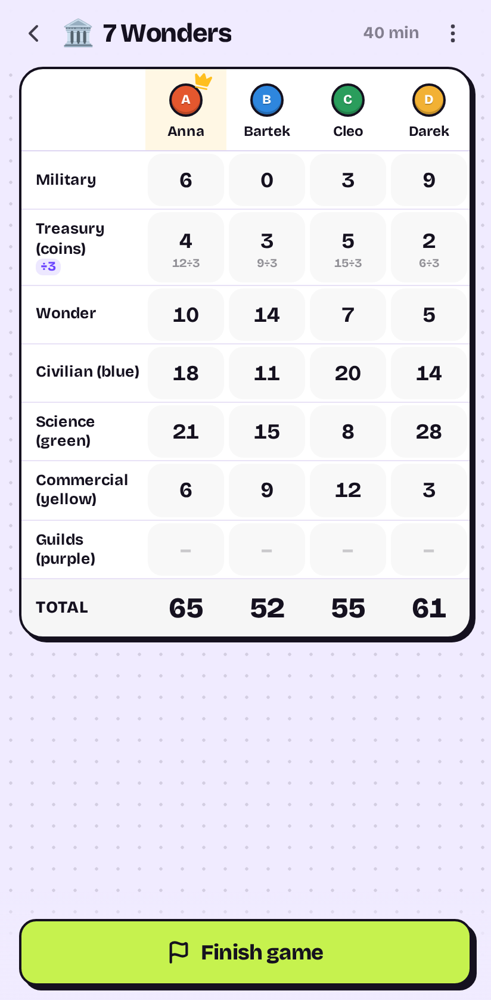<br><sub>Score sheet</sub></td>
<td align="center" width="20%">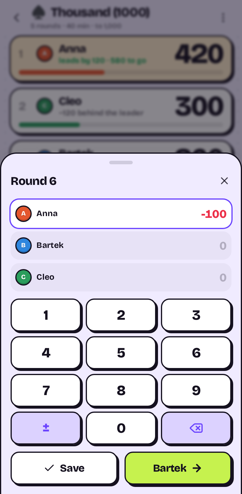<br><sub>Number pad</sub></td>
</tr>
</table>

<table>
<tr>
<td align="center" width="20%">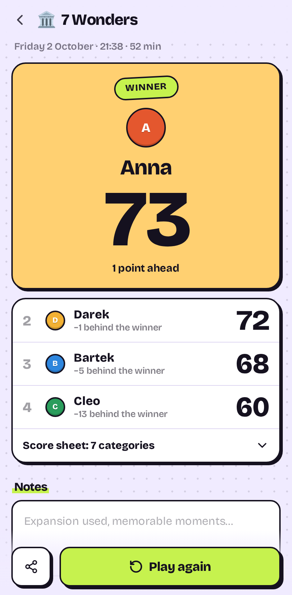<br><sub>Results</sub></td>
<td align="center" width="20%">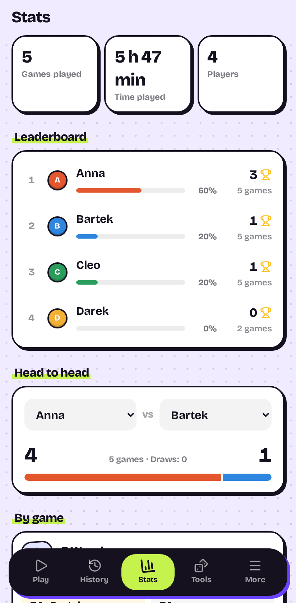<br><sub>Stats</sub></td>
<td align="center" width="20%">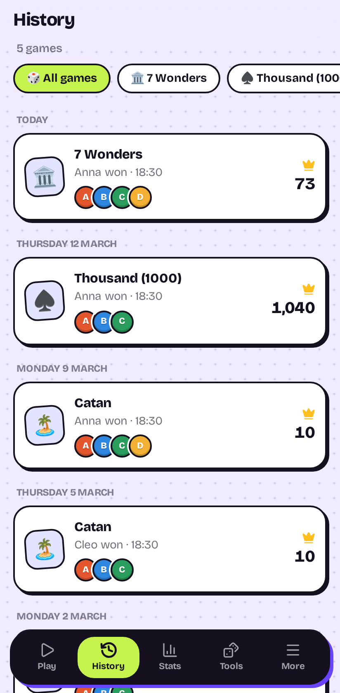<br><sub>History</sub></td>
<td align="center" width="20%">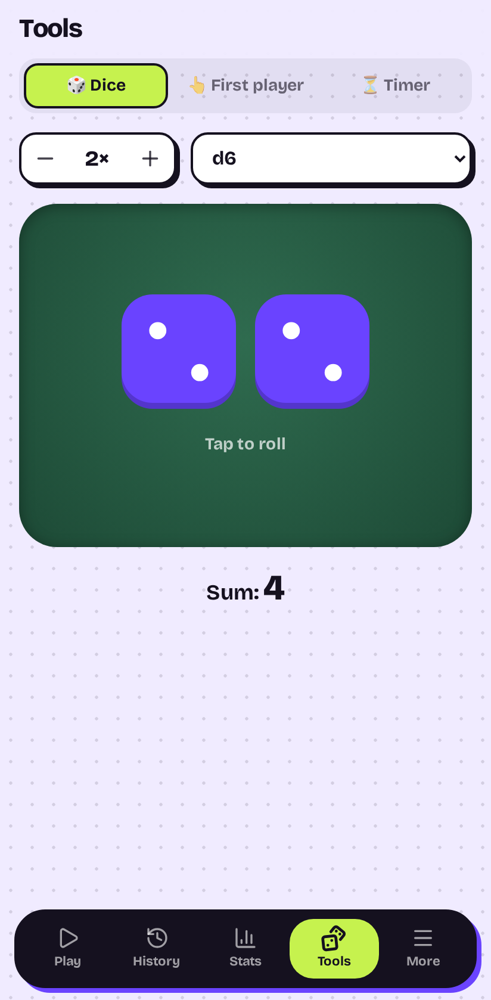<br><sub>Dice roller</sub></td>
<td align="center" width="20%">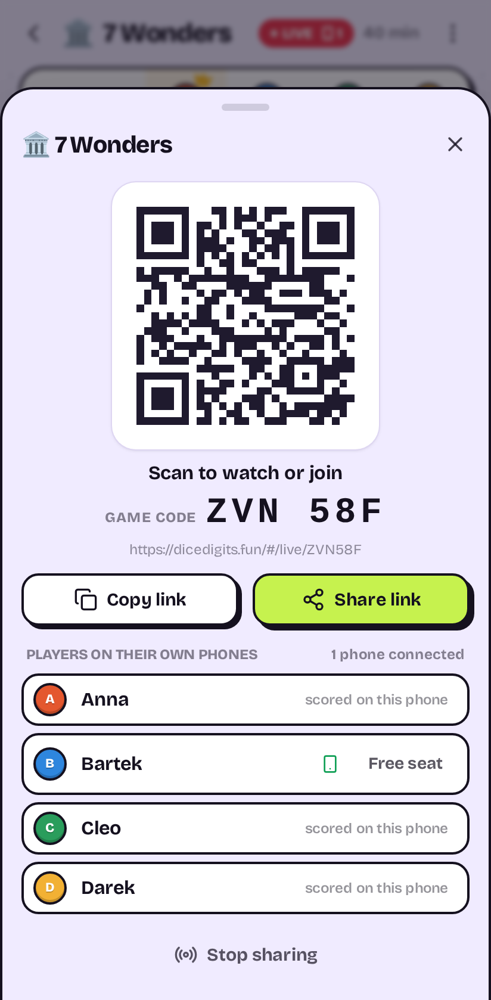<br><sub>Live game QR</sub></td>
</tr>
</table>

Regenerate them with `npm run screenshots` (seeded demo data, English and
Polish UI, written to `docs/screenshots/`).

## Features

**Scoring: four modes cover almost every game**

| Mode            | How it works                                                   | Good for                                     |
| --------------- | -------------------------------------------------------------- | -------------------------------------------- |
| **Counter**     | Big `+`/`−` buttons per player, quick steps, every tap logged  | Catan, Splendor, Cortex, Mordercze krewetki  |
| **Rounds**      | Enter everyone's points after each round; edit any past round  | Tysiąc, 6 bierze, Lato z komarami, Rummikub  |
| **Score sheet** | Category × player pad filled in at the end, with auto bonuses  | 7 Wonders, Domek, Szybka kawka, Zuuupa!      |
| **Winner only** | No points: tap who won the round (or who lost it)              | Eksplodujące kotki, Gorący ziemniak          |

- **28 built-in games** with their real scoring: 7 Cudów Świata, Na
  skrzydłach, Terraformacja Marsa, Wsiąść do pociągu (+ Europa with stations),
  Tysiąc, 6 bierze, Rummikub, Domek, Szybka kawka, Zuuupa!, Yahtzee with the
  upper-section +35 bonus, and more. Plus **your own games** with custom
  categories, quick buttons, a target score and lowest-wins.
- **Count, don't calculate**: a category can be worth ×n per item (3 upgrade
  tiles ×2, unused stations ×4, Zuuupa! vegetables ×3…×7) or ÷n (7 Wonders:
  1 point per 3 coins). You enter what's on the table; the app does the maths.
- **Zero-sum rounds** (Rummikub): losers enter their minus points, one tap gives
  the round's winner their sum.
- **Own number pad**, because the iOS numeric keyboard has no minus key and
  negative scores are routine (Tysiąc, failed tickets).
- Leader crown, a target-reached banner, undo, a per-tap history, and a
  **tie-break** picker on the results screen (or keep the shared victory).
- **Screen stays on** during a game (Wake Lock), haptic taps on Android.

**After the game**

- Podium + results, round/sheet breakdown, notes, "play again" with the same
  lineup, share the result as text.
- **History** grouped by day, filterable by game.
- **Stats**: games played, time played, a win-rate leaderboard, per-game records
  and average winning score, **head-to-head** between any two players.

**Table tools**: dice roller (d4–d20, coin), **finger picker** for the first
player (everyone touches the screen, one is chosen), and a tap-to-restart
**turn timer**.

**Optional cloud** (needs the worker):

- **Shared group**: friends join by invite link; players, custom games and
  finished games sync across everyone's phones, so the stats are shared.
- **Live game with QR code**: the scorekeeper taps *Share live*, a QR code
  (plus a 6-character code for typing in) appears, and friends scan it:
  - **watch**: the scores update instantly on their own phone, or
  - **join to score**: pick their seat and enter their own points, e.g. their
    7 Wonders column at the end, their +/− in Catan, or their score for each
    round of Tysiąc. They can only edit their own seat.
- The group invite is a QR code too (*More → Shared group → Invite*).
- **Cloud backup**: one tap backs up your players, custom games and finished
  games, with no account. You get six easy words to remember (and a QR),
  in English or Polish; typing them on a new phone, or after the browser is
  cleared, restores everything and merges it with what's already there.

### How a live game works

One phone is the **scorekeeper** (the host). It can edit every seat, keeps
working offline, and remains the source of truth. Players who joined send
small score changes ("ops") through the worker. The host applies them with the
same rules as its own taps and broadcasts the result to everyone. If the host
phone drops off (locked screen, no signal), players keep scoring: their entries
wait in the room and land as soon as the host is back. Every op has an id, so a
resend after a reconnect is never counted twice. The host can still undo, edit
anything, or free a seat, for example when someone's battery dies.

**Everything else**: PL/EN (auto-detected, switchable), auto/light/dark theme
without a flash, JSON backup export/import, offline after first load, and an
"update ready" prompt so a new deploy never reloads mid-game.

## Stack

React 19 + Vite + TypeScript + Tailwind v4, the same as
[ev_parking_app](https://github.com/imrahil/ev_parking_app). Additions:
`vite-plugin-pwa` (offline precache), `lucide-react` (icons), Vitest (logic
tests), `uqr` (QR codes generated on the phone). Backend: a Cloudflare Worker
with **D1** (SQLite) for shared groups, and a **Durable Object per live game**
for the WebSocket room. D1 rather than KV because sync writes on every
finished game, and KV's free tier allows 1,000 writes/day while D1 allows
100,000.

```
   host phone (localStorage, works offline)          players' & viewers' phones
        │  WebSocket: full session ▲ ops from players     │ WebSocket: ops ▲ session
        ▼                          │                      ▼                │
   ┌──────────── Room Durable Object (one per live game, code = name) ───────────┐
   │  latest session · seat claims · queue of ops waiting for the host · 48 h TTL │
   └──────────────────────────────────────────────────────────────────────────────┘
        │  POST /api/sync (finished games, players, custom games)
        ▼
   Cloudflare Worker ──► D1: groups · docs
```

Data is **local-first**: the app is fully usable without the worker. Sync is
last-write-wins per document on its `updatedAt`.

## Local development

```sh
npm install
npm run dev      # Vite dev server
npm test         # Vitest: scoring, stats, i18n, store, group sync
npm run lint     # ESLint (npm run lint:fix to auto-fix)
npm run e2e      # Playwright end-to-end, starts wrangler dev itself
npm run coverage # unit-test coverage report
npm run build    # type-check + production build to dist/
npm run preview  # serve the production build
```

Worker (see [`worker/README.md`](worker/README.md)):

```sh
cd worker
npm test                     # node:test against real SQLite, no dependencies
npx wrangler d1 migrations apply dice-and-digits --local
npx wrangler dev             # http://localhost:8787
```

To run the app against the local worker, set `VITE_API_URL=http://localhost:8787`
in `.env.local`.

## Deployment

**Frontend**: push to `main`. `.github/workflows/deploy.yml` first runs the
whole CI workflow (lint, unit and worker tests, build, Playwright end-to-end;
the same workflow also checks every pull request), then builds and publishes
`dist/` to GitHub Pages. Enable Pages once under
*Settings → Pages → Source: GitHub Actions*. The app lands at
`https://imrahil.github.io/dice-and-digits/`.

**Backend** (one-time; also after any change under `worker/`):

```sh
cd worker
npx wrangler login
npx wrangler d1 create dice-and-digits        # paste database_id into wrangler.toml
npx wrangler d1 migrations apply dice-and-digits --remote
npx wrangler deploy
```

Then put the printed worker URL into `.env` as `VITE_API_URL` and push. The
value is public, which is why `.env` is committed.

## Free plan vs. the $5 Workers Paid plan

The free plan is enough for a group of friends: 100k requests/day, D1 at 5M
rows read and 100k rows written per day, and SQLite-backed Durable Objects are
included. Live games use the WebSocket Hibernation API, so a quiet room costs
nothing between messages, and incoming WebSocket messages are billed at
1/20 of a request. A busy game night is a few thousand requests. Upgrading to
Paid would make sense for:

- **Rate limiting** on group creation, sync and opening live games.
- Much higher limits if the app is shared publicly.

## Persisted data

All in `localStorage` under the `dice-digits:` prefix: `players`, `games`
(custom only), `sessions`, `settings`, `dirty` (pending sync), `group` (shared
group credentials), `live` (host tokens of live games), `guest:<code>`
(a joined phone's seat token and not-yet-applied entries). Export/import in *More →
Backup* moves everything between devices without the cloud.
